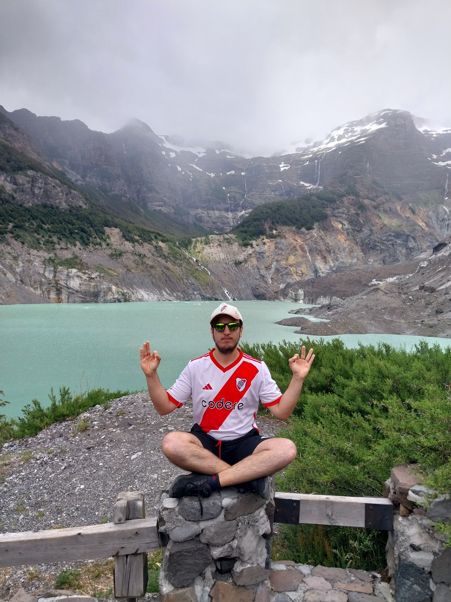

Creador
=======

- Nombre: Sebastian Sanchez Bentolila
- Edad: 18 años
- Ubicación: Llavallol, Buenos Aires, Argentina
- Correo electrónico: sebastiansb3004@gmail.com
- GitHub: `Sebastian-Sanchez-Bentolila <https://github.com/Sebastian-Sanchez-Bentolila>`_

¡Hola! ¿Qué tal? Soy estudiante de Ciencia de Datos en la UNAB (Universidad Nacional de Guillermo Brown), actualmente en segundo año. Mis objetivos profesionales son trabajar y profesionalizarme en el área de la ciencia de datos, aplicando las mejores técnicas disponibles.

Habilidades
-----------

- Python
- HTML
- CSS
- SQL
- MongoDB
- Arduino
- C++

Sobre mí
--------

Además de mis habilidades técnicas, soy scout en el grupo Madre Teresa de Calcuta (miembro Rover). También soy un ávido lector de géneros académicos, manga, crecimiento personal y ficción. Mantengo un estilo de vida activo físicamente, yendo al gimnasio y practicando ciclismo. Me gusta aprender y soy bastante autodidacta, ya sea a través de libros, cursos o videos.

Otros conocimientos que tengo son mecanizado CNC, impresión 3D, CAD, criptomonedas, NFT, hacking ético, contabilidad básica y primeros auxilios.